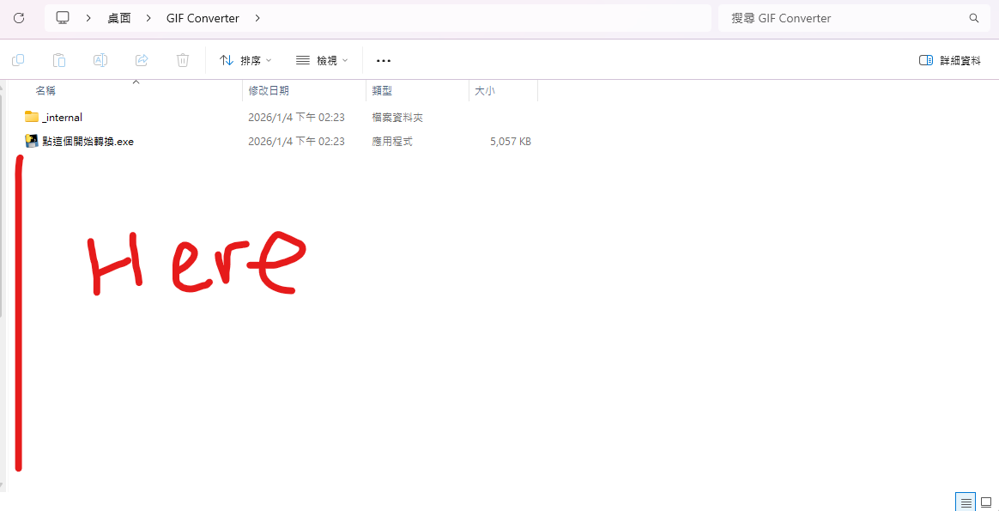
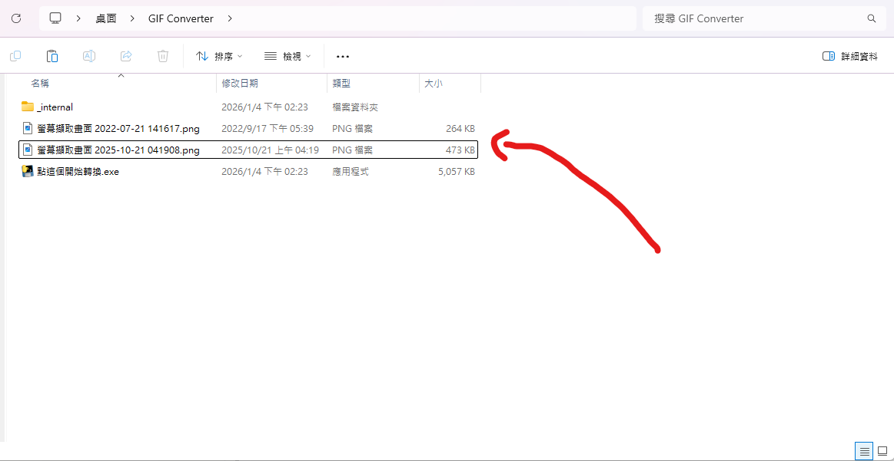
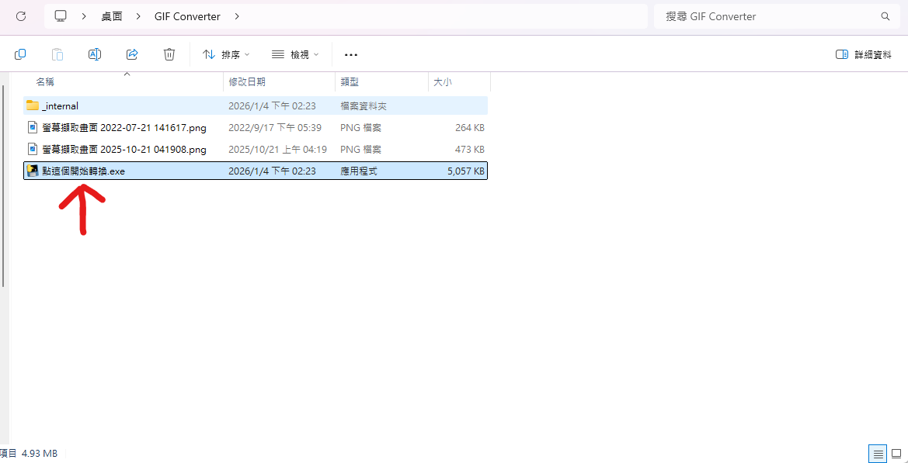
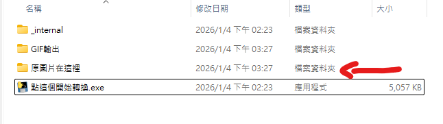
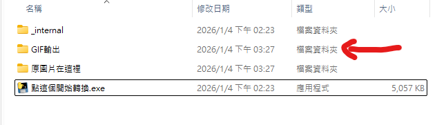

## 
GIF 轉換器
現行版本：1.0.0

1. 將下載的壓縮包解壓縮到你想要的位置 
2. 將圖片放置於資料夾   
> 支援的圖片格式有 <b>'.png', '.jpg', '.jpeg', '.bmp', '.tiff'</b>。 
> 支援多個圖片一起轉換。
</img> 
</img> 

3. 點擊 "點這個開始轉換.exe" 開始轉換圖片
> </img> 

4. 轉換後 
> 轉換後的原圖片在這裡： 
</img> 
> 轉換後的 GIF 圖檔在這裡：
</img> 